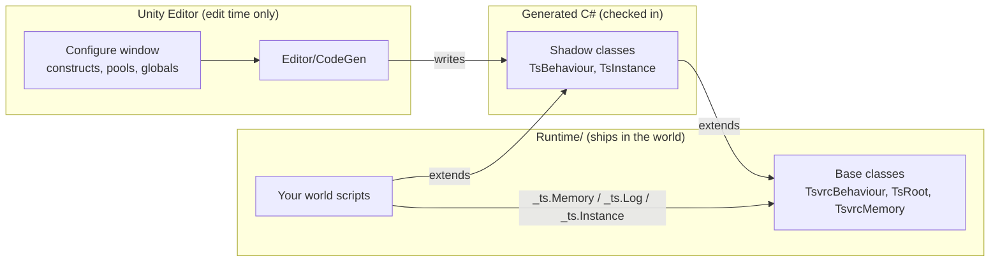

# TsVRC

[](https://github.com/tsvrc/tsvrc-core/stargazers)
[](https://github.com/tsvrc/tsvrc-core/commits/main)
[](https://github.com/tsvrc/tsvrc-core/releases)
[](LICENSE)

TsVRC is an open-source framework for building VRChat worlds with UdonSharp: structured
initialization, dependency wiring, and an editor tool that generates the code for both,
on top of the VRChat Worlds SDK.

Most frameworks like this resolve dependencies at runtime, through reflection or a
dependency-injection container. TsVRC resolves them once, at edit time: an editor pass
reads your project's configuration and writes plain C# with direct references already
baked in. Nothing gets looked up while the world is actually running.

Docs: [tsvrc.com](https://tsvrc.com).

*TsVRC is not affiliated with, endorsed by, or sponsored by VRChat Inc.*

## Quick look

```csharp
using Tsvrc.Core.Generated;

public class HelloWorld : TsBehaviour
{
    protected override void TsStart()
    {
        LogInfo("HelloWorld constructed.");
    }
}
```

Attach this to a GameObject, register it as a construct in **Tsvrc > Configure**, and
TsVRC calls `TsStart` on it once at world startup. Full walkthrough: [Build your first
behaviour](https://tsvrc.com/docs/tsvrc/first-behaviour).

## How it fits together

TsVRC splits into two halves: an editor pass that runs while you build, and plain
UdonSharp that runs for players. Your own scripts extend a generated shadow class rather
than the framework's runtime classes directly, so they get a typed reference back to your
project instead of a generic one.



Full explanation: [How TsVRC fits
together](https://tsvrc.com/docs/tsvrc/core-concepts/how-it-fits-together).

*Is this overcomplicated? idk, but I like it.*

## What's included

Six generated pieces cover most of what a world needs:

- **Constructs** — register a behaviour once and TsVRC initializes it for you, in a fixed
  order, instead of wiring startup by hand.
- **Globals** — point at a scene object once and reach it from any behaviour by name.
- **Memory** — a shared key-value store with ephemeral, persistent, and synced tiers.
- **Factories** — spawn a prefab on demand with a generated `_ts.Create...` call.
- **Pools** — pre-instantiate and wire exactly the instances a networked prefab needs,
  since VRChat can't sync an object created while the world is running.
- **Instance** — one behaviour standing in for the running world instance itself, found
  and wired automatically.

Details for each: [tsvrc.com/framework](https://tsvrc.com/framework).

## Install

Through the [VRChat Creator Companion](https://vcc.docs.vrchat.com/) (recommended, it
resolves the VRChat Worlds SDK version TsVRC depends on):

```
https://vpm.tsvrc.com/index.json
```

Add that as a community repository, then install **TsVRC** (`com.tsvrc.core`) from the
package list. Full steps, including the `.unitypackage` alternative: [Add TsVRC to your
project](https://tsvrc.com/docs/tsvrc/add-to-your-project).

## Contributing

TsVRC is pre-1.0 and still shaping its API, a good time to influence how a module works
rather than working around a locked one. Every runtime and codegen change ships with
tests, see [Testing your world](https://tsvrc.com/docs/tsvrc/testing/testing-your-world)
for the helpers used to test both this repo and your own.

See [CONTRIBUTING.md](CONTRIBUTING.md) for setup, running tests, and submitting a pull
request. Community conduct is covered by the [org-wide Code of
Conduct](https://github.com/tsvrc/.github/blob/main/CODE_OF_CONDUCT.md). Found a security
issue? See [SECURITY.md](SECURITY.md) rather than opening a public issue.

## Support

Entirely optional, and appreciated if you'd like to:
[tsvrc.com/support](https://tsvrc.com/support).

## License

Apache-2.0, see [LICENSE](LICENSE) and [NOTICE](NOTICE). The TsVRC name and logo are
governed separately, see
[TRADEMARK.md](https://github.com/tsvrc/.github/blob/main/TRADEMARK.md).

## Governance

See [GOVERNANCE.md](https://github.com/tsvrc/.github/blob/main/GOVERNANCE.md) for how
decisions get made and how to become a maintainer.
